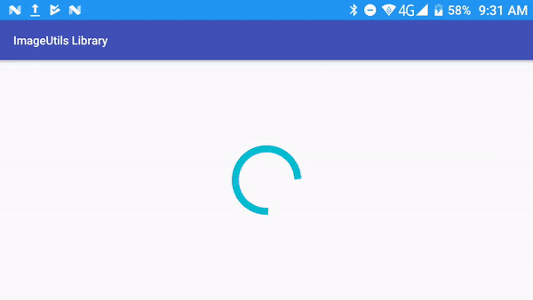

# RxImageUtils
A project to demonstrate image file opertaions like encryption &amp; decryption.

What this app does?
-------------------

1. Encrypt images and over-write
2. Decrypt images and over-write
3. Preview decrypted images on RecyclerView adapter
4. Uses RxJava2 fuctions
5. Used Glide to load images